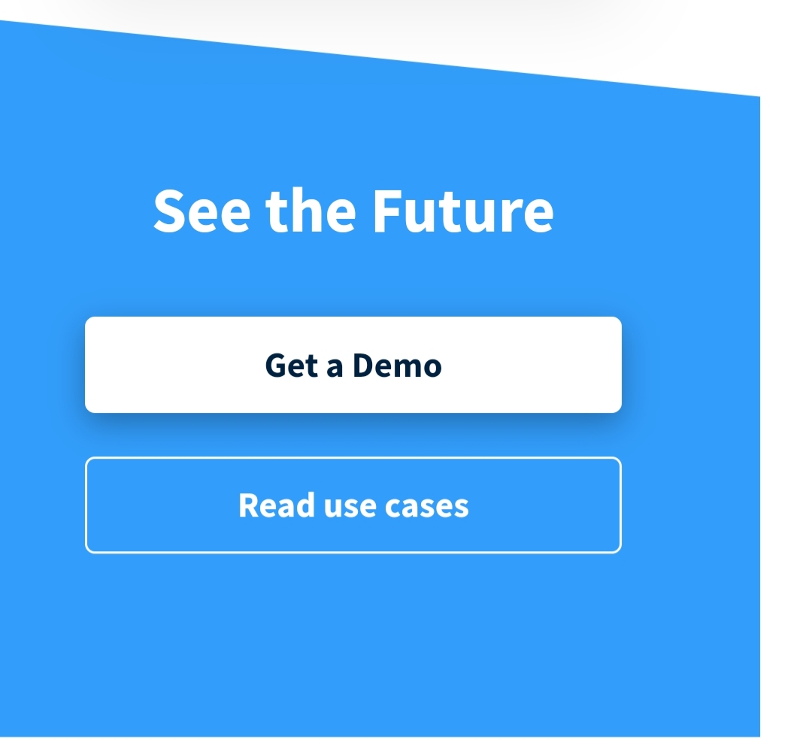
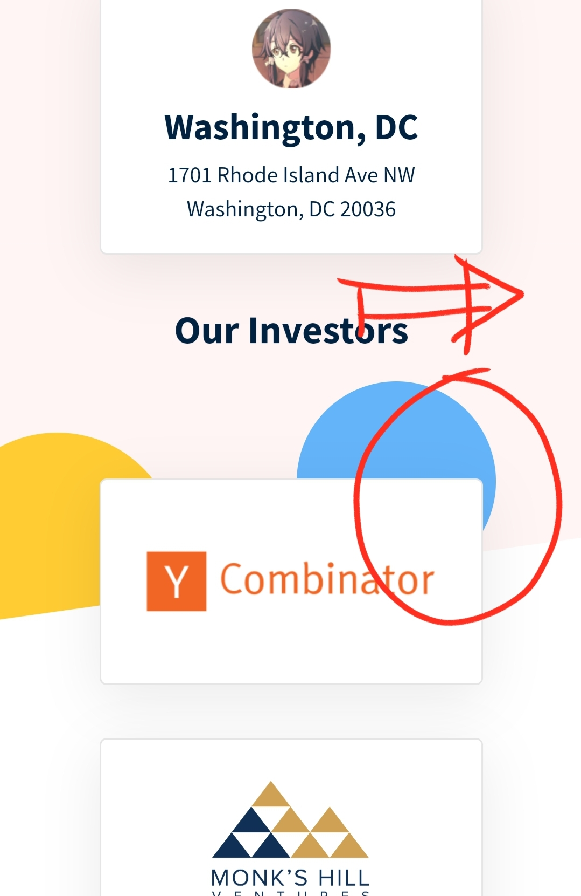

# Saleswhale Junior Web Development Test

**Site Link:** http://uwuwu-site.herokuapp.com/

Because the repo is private and GitHub doesn't like making private repos into pages unless I feed it cash. It's pretty sad.

## Progress
**Day 1 [23/05/2020]**
- I learned something new today and it makes me want to kms honestly

**Day 2 [24/05/2020]**
- [AM] Yay, I learned so much today that I might be able to actually start without a framework

- [PM] Mobile view almost done except for the footer; code needs clean up and might as well start on the tablet/desktop ~~hell~~ layout tomorrow

**Day 3 [25/05/2020]**
- [AM] Finished mobile layout without foooter; probably gonna start on tablet later cuz this bitch makes me go crazy

**Day 4 [26/05/2020]**
- [AM] Started on tablet layout ~~and it was confusing/annoying af~~

- [PM] Finished tablet layout

**Day 5 [27/05/2020]**

- Almost finished the desktop layout but I broke something cuz I thought it looked horrible. I'm extra sad now cuz I can't figure it out for now :<

**Day 6 [28/05/2020]**
- Polishing

**Day 7 [30/05/2020]**
- Ready for submission

## To Fix:

- [x] Width problem on mobile

- [x] Font styles on tablet mode

- [ ] Maybe centralize the timeline so when the browser is dragged, it stays at the certain (when I figure it out)

- [x] Footer link list lad. I want to fucking destroy it so much

- [x] Clip path references

- [x] Mobile footer image
